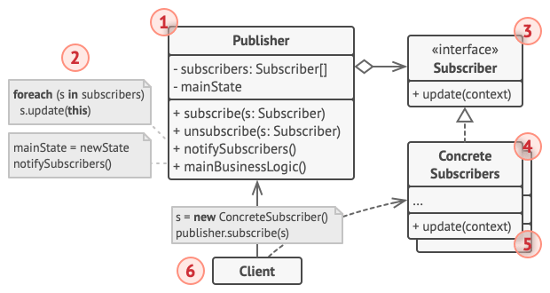

#### **Intent**

Observer is a behavioral design patter that lets you define a subscription mechanism to notify objects about any events that happen to the object they're observing.

#### **Problem**

Imagine that you have two types of objects: a `Customer` and a `Store`. The customer is very interested in a particular brand of product which should become available in the store very soon.

The customer could visit the store every day and check product availability. But while the product is still en route, most of these trips would be pointless.

On the other hand, the store could send tons of email to all customers each time a new product becomes available. This would save some customers from endless trips to the store. At the same time, it'd upset other customers who aren't interested in new products.

#### **Solution**

The object that has some interesting state is often called subject, but since it's also going to notify other objects about the changes to its state we'll call it publisher. All other objects that want to track changes to the publisher's state are called subscribers.

The Observer patter suggests that you add a subscription mechanism to the publisher class so individual objects can subscribe to or unsubscribe from a stream of events coming from that publisher. Fear not! Everything isn't as complicated as it sounds. In reality, this mechanism consists of 1) an array field for storing a list of references to subscriber objects and 2) several public methods which allow adding subscribers to and removing them from that list.

Now, whenever an important event happens to the publisher, it goes over its subscribers and calls the specific notification method on their objects.

Real apps might have dozens of different subscribers classes that area interested in tracking events of the same publisher class. You wouldn't want to couple the publisher to all of those classes. Besides, you might not even know about some of them beforehand if you publisher class is supposed to be used by other people.

That's why it's crucial that all subscribers implement the same interface and that the publisher communicates with them only via that interface. This interface should declare the notification method along with a set of parameters that the publisher can use to pass some contextual data along with the notification.

If your app has several different types of publishers and you want to make your subscribers compatible with all of them, you can go even further and make all publishers follow the same interface. This interface would only need to describe a few subscription methods. The interface would allow subscribers to observe publisher's states without coupling to their concrete classes.

#### **Real-World Analogy**

If you subscribe to a newspaper or magazine, you no longer need to go to the store to check if the next issue is available. Instead, the publisher sends new issues directly to your mailbox right after publication or even in advance.

The publisher maintains a list of subscribers and knows which magazines they're interested in. Subscribers can leave the list at any time when they wish to stop the publisher sending new magazine issues to them.

#### **Structure**

1. The Publisher issues events of interest to other objects. These events occur when the publisher changes its state or executes some behaviors. Publishers contain a subscription infrastructure that lets new subscribers join and current subscribers leave the list.
2. When a new event happens, the publisher goes over the subscription list and calls the notification method declared in the subscriber interface on each subscriber object.
3. The Subscriber interface declares the notification interface. In most cases, it consists of a single `update` method. The method may have several parameters that let the publisher pass some event details along with the update.
4. Concrete Subscribers perform some actions in response to notifications issued by the publisher. All of these classes must implement the same interface so the publisher isn't coupled to concrete classes.
5. Usually, subscribers need some contextual information to handle the update correctly. For this reason, publishers often pass some context data as arguments of the notification method. The publisher can pass itself as an argument, letting subscriber fetch any required data directly.
6. The Client creates publisher and subscriber objects separately and then registers subscribers for publisher updates.
#### **Applicability**

**Use the Observer pattern when changes to the state of one object may require changing other objects, and the actual set of objects is unknown beforehand or changes dynamically**

**Use the pattern when some objects in you app must observe others, but only for a limited time or in specific cases.**

#### **How to Implement**

1. Look over your business logic and try to break it down into two parts: the core functionality, independent from other code, will act as the publisher; the rest will turn into a set of subscriber classes.
2. Declare the subscriber interface. At a bare minimum, it should declare a single`update` method.
3. Declare the publisher interface and describe a pair of methods for adding a subscriber object to and removing it from the list. Remember that publishers must work with subscriber only via the subscriber interface.
4. Decide where to put the actual subscription list and the implementation of subscription method. Usually, this code looks the same for all types of publishers, so the obvious place to put it is an abstract class derived directly from the publisher interface. Concrete publishers extend that class, inheriting the subscription behavior.
   However, if you're applying the pattern to an existing class hierarchy, consider an approach based on composition: put the subscription logic into a separate object, and make all real publishers use it.
5. Create concrete publisher classes. Each time something important happens inside a publisher, it must notify all its subscribers.
6. Implement the update notifications methods in concrete subscriber classes. Most subscribers would need some context data about the event. It can be passed as an argument of the notification method.
   But there's another option. Upon receiving a notification, the subscriber can fetch any data directly from the notification. In this case, the publisher must pass itself via the update method. The less flexible option is to link a publisher to the subscriber permanently via the constructor.
7. The client must create all necessary subscribers and register them with proper publishers.

