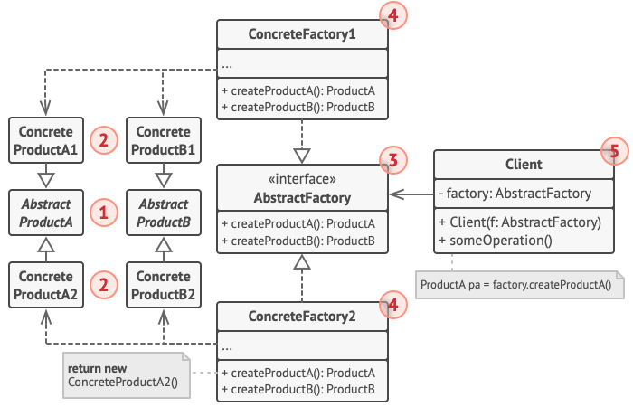

#### **Intent**

Abstract Factory is a creational design patter that lets you produce families of related objects without specifying their concrete classes.

#### **Problem**

Imagine that  you're creating a furniture shop simulator. Your code consists of classes that represent:
1. A family of related products: `Chair` + `Sofa` + `CoffeeTable`.
2. Several variants of this family. For examples, products `Chair` + `Sofa` + `CoffeeTable` are available in these variants: `Modern`, `Victorian`, `ArtDeco`.

You need a way to create individual furniture objects so that they match other objects of the same family. Customers get quite mad when they receive non-matching furniture.

Also, you don't want to change existing code when adding new products of families of products to the program. Furniture vendors update their catalogs very often, and you wouldn't want to change the core code each time it happens.

#### **Solution**

The first thing the Abstract Factory patter suggests is to explicity declare interfaces for each distinct product of the product family. Then you can make all of products follow those interfaces. For example, all chair variants can implement the `Chair` interface; all coffee table variants can implement the `CoffeeTable` interface, and so on.

The next move is to declare the Abstract Factory- an interface with a list of creatin methods for all products that are part of the product family. These methods must return abstract product types represented by the interfaces we extracted previously: `Chair`, `Sofa`, `CoffeeTable` and so on.

For each variant of product family, we create a separate factory class based on the `AbstractFactory` interface. A factory is a class that returns products of a particular kind. For example, the `ModernFurnitureFactory` can only create `ModernChair`, `ModernSofa` and `ModernCoffeeTable` objects.

The client code has to work with both factories and products via their respective abstract interfaces. This lets you change the type of a factory that you pass to the client code, as well as the product variant that the client code receives, without breaking the actual code.

Say the client wants a factory to produce a chair. The client doesn't have to be aware of the factory's class, nor does it matter what kind of chair it gets. Whether it's a Moden model or a Victorian-style chair, the client must treat all chairs in the same manner, using the abstract `Chair` interface. With this approach, the only thing that the client knows about the chair ir that it implements the `sitOn` method in some way. Also, whichever variant of the chair is returned, it'll always match the type of sofa or coffee table produced by the same factory object.

If the client is only exposed to the abstract interfaces, what creates the actual factory objects? Usually, the application creates a concrete factory object at the initialization stage. Just before that, the app must select the factory type depending on the configuration or the environment settings.

#### **Structure**

1. Abstract Products declare interfaces for a set of distinct but related products which make up a product family.
2. Concrete Products are various implementations of abstract products, grouped by variants. Each abstract product must be implemented in all given variants.
3. The Abstract Factory interface declares a set of methods for creating each of the abstract products.
4. Concrete Factories implement creation methods of the abstract factory. Each concrete factory corresponds to a especific variant of products and creates only those product variants.
5. Although concrete factories instantiate concrete products, signatures of their creatin methods must return corresponding abstract products. This way the client code that uses a factory doesn't get coupled to the specific variant of the product it gets from a factory. The Client can work with any concrete factory/product variant, as long as it communicates with their objects via abstract interfaces.

#### **Applicability**

**Use the Abstract Factory when your code needs to work with various families of related products, but you don't want it to depend on concrete classes of those products - they might be unknown beforehand or you simply want to allo for future extensibility**

**Consider implementing the Abstract Factory when you have a class with a set of Factory Methods that blur its primary resopnsibility**

#### **How To Implement**

1. Map out a matrix of distinct product types versus variant of these products.
2. Declare abstract product interfaces for all product types. Then make all concrete product classes implement these interfaces.
3. Declare the abstract factory interface with a set of creation methods for all abstract products.
4. Implement a set of concrete factory classes, one for each product variant.
5. Create factory initialization code somewhere in the app. It should instantiate one of the concrete factory classes, depending on the application configuration or the current environment. Pass this factory object to all classes that construct products.
6. Scan through the code and find all direct calls to product constructors. Replace them with calls to the appropriate creation method on the factory object.