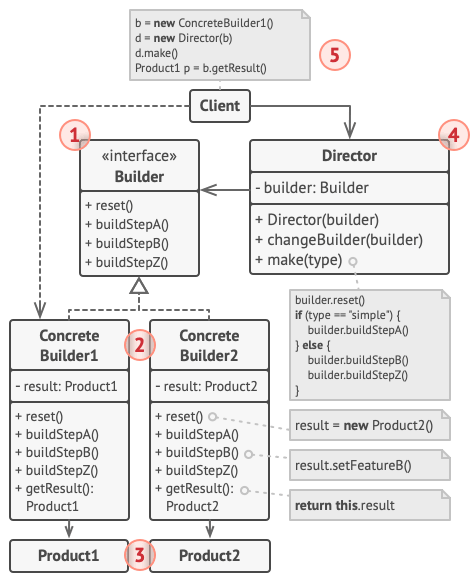

#### **Intent**

Builder is a creational design patter that lets you construct complex objects step by step. The pattern allows you to produce different types and representations of an object using the same construction code.

#### **Problem**

Imagine a complex object that requires laborious, step-by-step initialization of many fields and nested objects. Such initialization code is usually buried inside a monstrous constructor with lots of parameters. Or even worse: scattered all over the client code.

For example, let's think about how to create a `House` object. To build a simple house, you need to construct four walls and a floor, install a door, fit a pair of windows, and build a roof. But what if you want a bigger, brighter house, with a backyard and other goodies?

The simplest solution is to extend the base `House` class and create a set of subclasses to cover all combinations of the parameters. But eventually you'll end up with a considerable number of subclasses. Any new parameter, such as the porch style, will growing this hierarchy even more.

There's another approach that doesn't involve breeding subclasses. You can create a giant constructor right in the base `House` class with all possible parameters that control the house object. While this approach indeed eliminates the need for subclasses, it creates another problem.

In most cases of the parameters will be unused, making the constructor calls pretty ugly. For instance, only a fraction of houses have swimming pools, so the parameter related to swimming pools will be useless nine times out of ten.

#### **Solution**

The Builder pattern suggest that you extract the object constrution code out of its own class and move it to separate objects called builders.

The pattern organizes object construction into a set of steps. To create an object, you execute a series of these steps on a builder object. The important part is that you don't need to call all of the steps. You can call only those steps that are necessary for producing a particular configuration of an object.

Some of the construction steps might require different implementation when you need to build various representation of the product.

In this case, you can create several different builder classes that implement the same set of building steps, but in a different manner. Then you can use these builders in the construction process to produce different kinds of objects.

For example, imagine a builder that builds everything from wood and glass, a second one that builds everything with stone and iron and a third one that uses gold and diamonds. By calling the same set of steps, you get a regular house from the first builder, a small castle from the second and a palace from the third. However, this would only work if the client code that calls the building steps is able to interact with builders using a common interface.

**Director**

You can go further and extract a series of calls to the builder steps you use to construct a product into a separate class called director. The director class defines the order in which to execute the building steps, while the builder provides the implementation for those steps.

Having a director class in your program isn't strictly necessary. You can always call the building steps in a specific order directly from the client code. However, the director class might be a good place to put various construction routines so you can reuse them across your program.

In addition, the director class completely hides the details of product construction from the client code. The client only needs to associate a builder with a director, launch the construction with the director, and get the result from the builder.

#### **Structure**

1. The Builder interface declares product construction steps that are common to all types of builders.
2. Concrete Builders provide different implementations of the construction steps. Concrete builders may produce products that don't follow the common interface.
3. Products are resulting objects. Products constructed by different builders don't have to belong to the same class hierarchy or interface.
4. The Director class defines the order in which to call construction steps, so you can create and reuse specific configurations of products.
5. The Client must associate one of the builder objects with the director. Usually, it's done just once, via parameters of the director's constructor. Then the director uses that builder object for all further construction. However, there's an alternative approach for when the client passes the builder object to the production method of the director. In this case, you can use a different builder each time you produce something with the director.

#### **Applicability**

**Use the Builder pattern to get rid of "telescoping constructor"**

**Use the Builder pattern when you want your code to be able to create different representation of some product.**

**Use the Builder to construct Composite trees or other complex objects**

#### **How to Implement**

1. Make sure that you can clearly define the common construction steps for building all available product representations. Otherwise, you won't be able to proceed with implementing the pattern.
2. Declare these steps in the base builder interface.
3. Create a concrete builder class for each of the product representations and implement their construction steps.
   Don't forget about implementing a method for fetching the result of the construction. The reason why this method can't be declared inside the builder interface is that various builders may construct products that don't have a common interface. Therefore, you don't know what would be the return type for such a method. However, if you're dealing with products from a single hierarchy, the fetching method can be safely added to the base interface.
4. Think about creating a director class. It may encapsulate various ways to construct a product the same builder object.
5. The client code creates both the builder and the director objects. Before construction starts, the client must pass a builder object to the director. Usually, the client does this only once, via parameters of the director's class constructor. The director uses the builder object in all further construction. There's an alternative approach, where the builder is passes to a specific product construction method of the director.
6. The construction result can be obtained directly from the director only if all products follow the same interface. Otherwise, the client should fetch the result from the builder.

