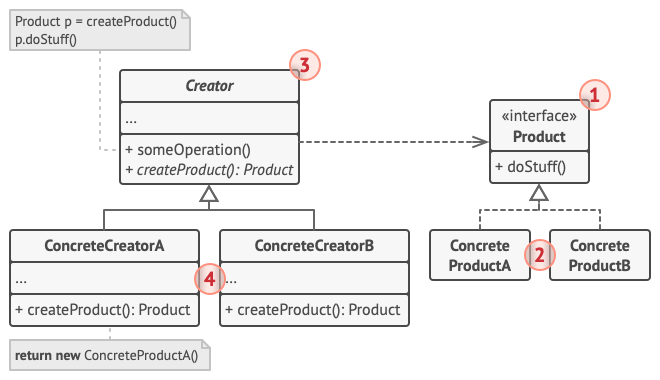

**Aka** Virtual Constructor

#### **Intent**

**Factory Method** is a creational design pattern that provides an interface for creating objects in a superclass, but allows subclasses to alter the type of objects that will be created.

#### **Problem**

Imagine creating a logistics management application. The first version can only handle transportation by trucks, so the bulk of your code lives inside the `Truck` class.

After a while, the application becomes popular, each day you receive dozens of requests from sea transportation companies to incorporate sea logistics into the app.

At the present, most of your code is coupled to `Truck` class. Adding `Ships` into the app would require making changes in the entire codebase, and, if later you decide to add another type of transportation, you will probably need to make all these changes again.

#### **Solution**

The Factory Method pattern suggests that you replace direct object construction calls (using the `new` operator) with calls to a special factory method.

At first glance, this change may look pointless: we just moved ths constructor call from one part of the program to another. However, consider this: now you can override the factory method in a subclass and change the class of products being created by the method.

There's a slight limitation though: subclasses may return different types of products only if these products have a common base class of interface. Also, the factory method in the base class should have its return type declared as this interface.

For example, both `Truck` and `Ship` classes should implement the `Transport` interface, which declares a method called `deliver`. Each class implements this method differently. The factory method in the `RoadLogistics` class returns truck objects, whereas the factory method in the `SeaLogistics` class returns ships.

The code that uses the factory method (often called the client code) doesn't see a difference between the actual products return by various subclasses. The client treats all the products as abstract `Transport`. The client knows that all transport objects are supposed to have the `deliver` method, but exactly how it works isn't important to the client.

#### **Structure**

1. The Product declares the interface, which is common to all objects that can be produced by the creator and its subclasses.
2. Concrete Products are different implementations of the product interface.
3. The Creator class declares the factory method that returns new product objects. It's important that the return type of this method matches the product interface.
   You can declare the factory method as `abstract` to force all subclasses to implement their own versions of the method. As an alternative, the base factory method can return some default product type.
   Note, despite its name, product creation is not the primary responsibility of the creator. Usually, the creator class already has some core business logic related to products. The factory method helps to decouple this logic from the concrete product classes.
4. Concrete Creators override the base factory method so it returns a different type of product.
   Note that the factory method doesn't have to create new instances all the time. It can also return existing objects from a cache, an object pool, or another source.

#### **Applicability**

**Use the Factory Method when you don't know beforehand the exact types and dependencies of the objects your code should work with**

The Factory Method separates product construction code from the code that actually uses the product. Therefore it's easier to extend the product construction code independently from the rest of the code.

**Use the Factory Method when you want to provide users of your library or framework with a way to extend its internal components.**

Inheritance is probably the easiest way to extend the default behavior of a library or framework. But how would the framework recognize that your subclass should be used instead of a standard component?

The solution is to reduce the code that constructs components across the framework into a single factory method and let anyone  override this method in addition to extending the component itself.

Let's see how that would work. Imagine that you write an app using an open source UI framework. Your app should have round buttons, but the framework only provides square ones. You extend the standard `Button` class with a glorious `RoundButton` subclass. But now you need to tell the main `UIFramework` class to use the new button subclass instead of a default one.

To achieve this, you create a subclass, you create a subclass `UIWithRoundButtons` from a base framework class and override its `CreateButton` method. While this method returns `Button` objects in the base class, you make your subclass return `RoundButton` objects. Now use the `UIWithRoundButtons` class instead of `UIFramework`

**Use the Factory Method when you want to save system resources by reusing existing objects instead of rebuilding them each time.**

**How to Implement**
1. Make all products follow the same interface. This interface should declare methods that make sense in every product.
2. Add an empty factory method inside the creator class. The return type of the method should match the common product interface.
3. In the creator's code find all references to product constructors. One by one, replace them with calls to the factory method, while extracting the product creation code into the factory method.
   You might need to add a temporary parameter to the factory method to control the type of returned product.
   At this point, the code of the factory method may look pretty ugly. It may have a large `switch` statement that picks which product class to instantiate. But don't worry, we'll fix it soon enough.
4. Now, create a set of creator subclasses for each type of product listed in the factory method. Override the factory method in the subclasses and extract the appropriate bits of construction code from the base method.
5. If there are too many products types and it doesn't make sense to create subclasses for all of them, you can reuse the control parameter from the base class in subclasses.
   For instance, imagine that you have following hierarchy of classes: the base `Mail` class with a couple of subclasses: `AirMail` and `GroundMail`; the `Transport` classes are `Plane`, `Truck` and `Train`. While `AirMail` class only uses `Plane` objects, `GroundMail` may work with both `Truck` and `Train` objects. You can create a new subclass (say `TrainMail`) to handle both cases, but there's another option. The client code can pass an argument to the factory method of the `GroundMail` class to control which product it wants to receive.
6. If, after all of the extractions, the base factory method has become empty, you can make it abstract. If there's something left, you can make it default behavior of the method.

