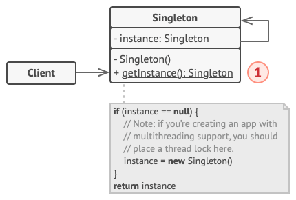

Is a creational design pattern that lets you ensure that a class has only one instance, while providing a global access point to this instance.

#### **Problem**

This pattern solves two problems at the same time, violating the _Single Responsibility Principle_:
1. Ensure that a class has just a single instance.
2. Provide a global access point to that instance

#### **Solution**

All implementations of the _Singleton_ have these two steps in common:
* Make the default constructor private, to prevent other objects from using the `new` operator with the Singleton class;
* Create a static creation method that acts as a constructor. Under the hood, this method calls the private constructor to create an object and saves it in a static field. All folowing calls to this method return the cached object
  If the code has access to the Singleton class, the it's able to call the Singleton's static method.

#### **Real-World Analogy**

The government is an excellent example of the Singleton pattern. A country can have only one official government. Regardless of the personal identities of the individual who form governments, the title, "The Government of X", is a global point of access that identifies the group of people in charge.

#### **Structure**

1. The Singleton Class declares the static method getInstance that `returns` the same instance of its own class

The Singleton's constructor should be hidden from the client code. Calling the `getInstance` method should be the only way of getting the Singleton Object.

#### **Applicability**

**Use the Singleton pattern when a class in your program should have just a single instance available to all clients**

The Singleton pattern disables all other means of creating objects of a class except for the special creation method. This method either creates a new object or returns an existing one if it has already been created

**Use the Singleton pattern when you need stricter control over global variables**

Unlike global variables, the Singleton pattern guarantees that there's just one instance of a class. Nothing, except for the Singleton class itself, can replace the cached instance.

#### **How to Implement**

1. Add a private static field to the class for storing the singleton instance;
2. Declare a public static creation method for getting the singleton instance;
3. Implement "lazy initialization" inside the static method. It should create a new object on its first call and put it into the static field. The method should always return that instance on all subsequent calls;
4. Make the constructor of the class private. The static method of the class will still be able to call the constructor, but not the other objects;
5. Go over the client code and replace all direct calls to the singleton's constructor with calls to its static creation method.

