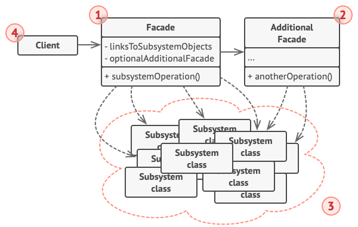

#### **Intent**
Facade is structural pattern that provides a simplified interface to a library, a framework, or any other complex set of classes.

#### **Problem**
Imagine that you must make your code work with a broad set of objects that belong to a sophisticated library or framework. Ordinaryli, you'd need to initialize all of those objects, keep track of dependencies, execute methods in the correct order, and so on.

As a result, the business logic of your classes would become tightly coupled to the implementation details of 3rd-party classes, making it hard to comprehend and mantain.

#### **Solution**

A facade is a class that provides a simples interface to complex subsystem which contains lots of moving parts. A facade might provide limited functionality in comparision to working with the subsystem directly. However, it includes only those features that clients really care about.

Having a facade is handy when you need to integrate your app with a sophisticated library that has dozens of features, but you just need a tiny bit of its functionality.

#### **Real-World Analogy**

When you call a shop to place a phone order, an operator in your facade to all services and departments of the shop. The operator provides you with a simple voice interface to the ordering system, payment gateways, and various delivery services.

#### **Structure**

1. The Facade provides convenient access to a particular part of the subsystem's functionality. It knows where to direct the client's request and how to operate all the moving parts;
2. An Additional Facade class can be create to prevent polluting a single facade with unrelate features that might make it yet another complex structure. Additional facades can be used by both clients and other facades;
3. The Complex Subsystem consists of dozens of various objects. To make them all do something meaningful, you have to dive deep into the subsystem's implementation details, such as initializing objects in the correct order and supplying them with data in the proper format.
   Subsystem classes aren't aware of the facade's existence. They operate within the system and work with each other directly.
4. The Client uses the facade instead of calling the subsystem objects directly

#### **Applicability**

**Use the Facade pattern when you need to have a limited but straightforward interface to a complex subsystem**

Often, subsystems get more complex over time. Even applying design patterns typically leads to creating more classes. A subsystem may become more flexible and easier to reuse in various contexts, but the amount of configuration and boilerplate code it demands from a client grows ever larger. The Facada attempts to fix this problem by providing a shortcut to the most-used features of the subsystem which fit most client requirements.

**Use the Facade when you want to structure a subsystem into layers**

Create facades to define entry points to each level of a subsystem. You can reduce coupling between multiple subsystems by requiring them to communicate only through facades.

#### **How to Implement**

1. Check whether it's possible to provide a simpler interface than what an existing subsystem already provides. You're on the right track if this interface makes the client code independent from many of the subsystem's classes.
2. Declare and implement this interface in a new facade class. The facade should redirect the calls from the client code to appropriate objects of the subsystem. The facade should be responsible for initializing the subsystem and managing its further life cycle unless the client code already does this.
3. To get the full benefit from the pattern, make all the client code communicate with the subsystem only via facade. Now the client code is protected from any changes in the subsystem code.
4. If the facade becomes too big, consider extracting part of its behavior to a new, refined facade class.